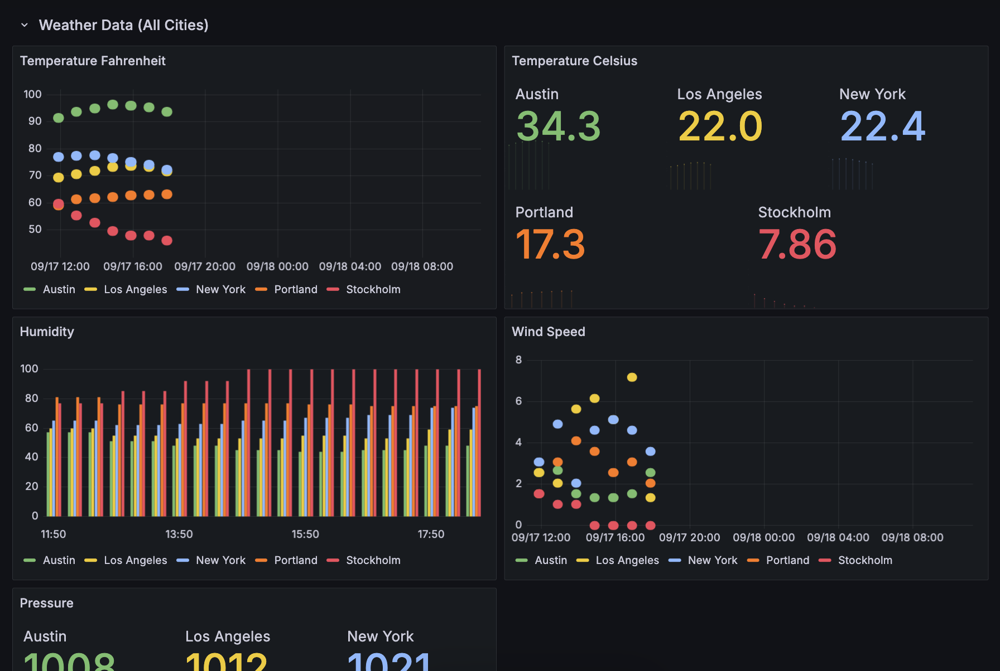
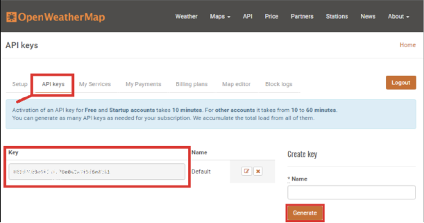
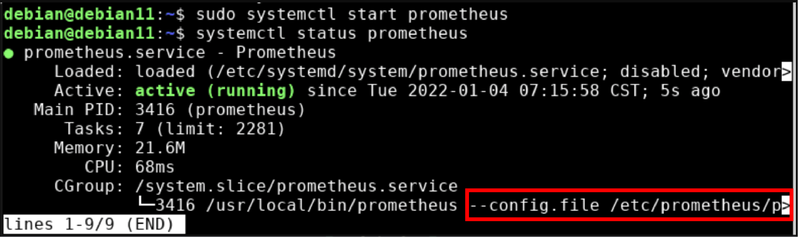
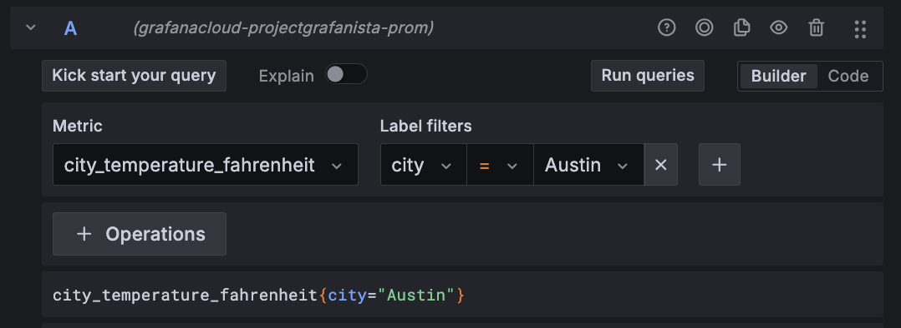
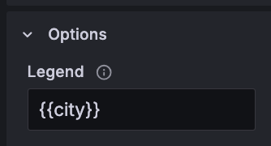

<!--
Documentation for Project_Grafanista
-->
<div align="center">

  
  <h1>Project Grafanista Documentation
</h1>
  
  <p>
    This documentation goes over the process of configuring Prometheus to use the OpenWeatherMap API to ultimately gather weather data and then visualize this data in Grafana Cloud.
  </p>

  <p>
    This will be done 100% free by using free trial Grafana Cloud account, Prometheus (OS) running locally, and using the free OpenWeatherMap API.
  </p>
  
  
<!-- Badges -->
<p>
  <a href="">
    
  </a>
  <a href="">
    
  </a>
  <a href="">
    
  </a>
</p>
   
<h4>
    <a href="https://github.com/tayders017/the.tech.taylor/tree/main/projects/Grafana/Project_Grafanista/assets/grafana_weather_dash.png">View Dashboard Example</a>
  <span> · </span>
    <a href="https://github.com/tayders017/the.tech.taylor/tree/main/projects/Grafana/Project_Grafanista/Project_Grafanista.md">Documentation</a>
  </h4>
</div>

<br />

<!-- Table of Contents -->
# :notebook_with_decorative_cover: Table of Contents

- [Introduction](#star2-about-the-project)
  * [Screenshots](#camera-screenshots)
  * [Tech Stack](#space_invader-tech-stack)
  * [Environment Variables](#key-environment-variables)
- [Getting Started](#toolbox-getting-started)
  * [Prerequisites](#bangbang-prerequisites)
  * [Installation](#gear-installation)
  * [Run Script to Get Weather Data](#running-run-script-to-get-weather-data)
  * [Edit Prometheus Configuration](#memo-edit-prometheus-configuration)
  * [Create Grafana Account](#white_check_mark-create-grafana-account)
  * [Integrate Prometheus](#paperclips-integrate-prometheus)
  * [Create Dashboard Visualization](#chart_with_upwards_trend-create-dashboard)
- [Usage Tips](#warning-usage-tips)
- [Challenges and Solutions](#triangular_flag_on_post-challenges-and-solutions)
- [Enhancements](#bulb-enhancements)
- [Conclusion](#eight_pointed_black_star-conclusion)
- [References](#gem-references)

  
<!-- Introduction -->
## :star2: Introduction


<!-- Screenshots -->
### :camera: Screenshots

<div align="center"> 
  
</div>


<!-- TechStack -->
### :space_invader: Tech Stack

<details>
  <summary>OS/Virtualization</summary>
  <ul>
    <li><a href="https://www.virtualbox.org/">VirtualBox</a></li>
    <li><a href="https://ubuntu.com/download/">Ubuntu</a></li>
  </ul>
</details>

<details>
  <summary>Monitoring/Data Collection</summary>
  <ul>
    <li><a href="https://prometheus.io/">Prometheus</a></li>
  </ul>
</details>

<details>
<summary>Data Source/External API</summary>
  <ul>
    <li><a href="https://openweathermap.org/api/">OpenWeatherMap API</a></li>
  </ul>
</details>

<details>
<summary>Data Visualization/Cloud Monitoring</summary>
  <ul>
    <li><a href="https://grafana.com/products/cloud/">Grafana</a></li>
  </ul>
</details>


<!-- Env Variables -->
### :key: Environment Variables

Must have an OpenWeatherMap API key in order to have access to weather data.

To get an OpenWeatherMap API key:
- Sign up for a free OWM account, link here: <a href="https://openweathermap.org/">OpenWeatherMap</a>
- Once logged in, navigate to API keys and either use a key that is already active or generate a new API key.
- After the key is generated it can now be copied and pasted into the script (or wherever else it is needed).
<a href="" />


<!-- Getting Started -->
## 	:toolbox: Getting Started

<!-- Prerequisites -->
### :bangbang: Prerequisites

This project will be performed on a clean Ubuntu VM that was created in VirtualBox with Python and Pip installed.

Before starting, verified the following tools and services were installed or available:
- Prometheus installed and running.
- Grafana Cloud account.
- OpenWeatherMap API key.


<!-- Installing prometheus_client Python library -->
### :gear: Installation

Before installing the prometheus_client Python library, verify everything is up-to-date with the latest updates.

Check for updates:

```bash
  sudo apt update
```

Run updates:

```bash
  sudo apt upgrade
```

Next, install the prometheus_client Python library. This allows the weather data to be exposed as Prometheus metrics.

Run the following to install the prometheus_client Python library:

```bash
  pip install requests prometheus_client
```

<!-- Create and run a python script to get weather data -->
### :running: Run Script to Get Weather Data

Use a python script and the OpenWeatherMap API to periodically get weather data, expose the data as Prometheus metrics, and run a simple HTTP server to allow Prometheus to scrape the weather metrics.

Use script weather_exporter.py located in this GitHub project:
- <a href="https://github.com/tayders017/the.tech.taylor/tree/main/projects/Grafana/Project_Grafanista/weather_exporter.py">/weather_exporter.py</a>
- Update the script to reflect the correct API_KEY information and to ensure it has the desired 'cities' to pull data for listed.
  - Steps on generating OpenWeatherMap API key are covered above.

Run the script to start the server:

```python
  python3 weather_exporter.py
```

Check the server to verify the metrics.

Open your web browser and navigate to:

```
  http://<prometheus-ip>:8000/metrics
```

<!-- Edit configuration for Prometheus to Scrape Weather Data -->
### :memo: Edit Prometheus Configuration

Update the prometheus.yml file to add the Python script as a target.

Locate the prometheus.yml file by running the following command and verifying the file location:

```bash
  sudo systemctl status prometheus
```
<a href="" />

Then update the prometheus.yml, this can be done via TextEdit or cli:

```bash
  sudo nano /etc/prometheus/prometheus.yml
```

Update the file and save when finished:

```bash
  scrape_configs: 
  - job_name: 'weather_exporter' 
    static_configs: 
      - targets: ['<VM_IP>:8000']
```
- If needed, verify the IP for the VM by running the following command:
```bash
  ifconfig
```

Lastly, restart Prometheus anytime changes are made to the .yml for the configuration to take effect:

```bash
  sudo systemctl restart prometheus
```

Run the below command to check the status of Prometheus and make sure it is running again:

```bash
  sudo systemctl status prometheus
```
- If Prometheus needs to be started, run the following command:

```bash
  sudo systemctl start prometheus
```

<!-- Set up Grafana Cloud Account (free version) -->
### :white_check_mark: Create Grafana Cloud Account

Sign up for a Grafana Cloud account through the Grafana site.

Visit Grafana Cloud and create a free account:

```
  https://grafana.com/auth/sign-up/create-user
```

After the account is active, access your Grafana Cloud portal home.

```
  https://<GRAFANA_ACCOUNT_NAME>.grafana.net/a/cloud-home-app
```

<!-- Integrate Prometheus with Grafana Cloud (aka. add new data source) -->
### :paperclips: Integrate Prometheus

Configure local Prometheus instance to push metrics to Grafana Cloud using the provided remote_write URL and API Key by creating a Prometheus data source in Grafana Cloud so the weather data can be further visualized.

Follow the instructions to create a new Prometheus data source in Grafana Cloud.
- See documentation for refrence: <a href="https://grafana.com/docs/grafana/latest/datasources/prometheus/configure-prometheus-data-source/#configure-the-data-source">Configure the data source</a>

Find and gather the Remote Write Endpoint URL and API Key under the settings for Prometheus.
- The URL is where Prometheus will send the data.
- Example of URL:

```
  https://prometheus-blocks-us-central1.grafana.net/api/prom/push
```

Use the Remote Write Endpoint URL and the API Key to update the Prometheus configuration file.

```bash
remote_write:
  - url:  'https://prometheus-us-1-example.grafana.net/api/prom/push' 
    basic_auth: 
      username: <Grafana_Cloud_Username>
      password: <Grafana_Cloud_API_Key>
      #Provided in Grafana setup instructions
```

Lastly, restart Prometheus so the changes to the configuration are applied:

```bash
  sudo systemctl restart prometheus
```

<!-- Create dashboard(s) in Grafana Cloud to visualize the data -->
### :chart_with_upwards_trend: Create Dashboard Visualization

Create a new dashboard in Grafana to view the weather metrics data.
- In the Grafana Cloud UI, go to Dashboards and select New Dashboard.
- Add panels and query your custom metrics (e.g., city_temperature_celsius{city="Stockholm"}) to visualize the weather data.
- Here is an example of the panel query: 
<a href="" />
- Update the Legend with "Custom" so the label for the query is easier to read.
<a href="" />

<!-- Usage tips; things to note when referencing any details included in this document -->
## :warning: Usage Tips

Below are a few tips when referencing any steps in this project documentation.

Enable Prometheus to start on boot:

```bash
  sudo systemctl enable prometheus
```

To keep the script running in the background, run:

```bash
  python3 weather_exporter.py $
```


<!-- Challenges encountered throughout project and solutions to said challenges, as well as enhancement opportunities -->
## :triangular_flag_on_post: Challenges and Solutions

Challenges incurred throughout the project with solutions:
- API Limitations:
  - Using the free version of the OpenWeatherMap API has its limits, for instance, only the paid/pro version is able to gather historical data (ie. past/future data).
- Incountered error "Error: externally-managed-environment":
  - Resolve by running:
  ```bash
    python3 -m venv ~/py_envs
    source ~/py_envs/bin/activate
    python3 -m pip install xyz
  ```
  - Review the following article for more in depth details on the error:
  ```
    https://builtin.com/articles/error-externally-managed-environment
  ```
  

<!-- Challenges encountered throughout project and solutions to said challenges, as well as enhancement opportunities -->
## :bulb: Enhancements

Enhancements that can be made to project for future release:
- To enhance the configuration and make it more robust, Prometheus could be ran from a Docker container.
  - This would provide advanced scalability and would allow further isolation from the host system.
  - The following documentation provides details on this: Install Docker Engine on Ubuntu - 
  ```
    https://docs.docker.com/engine/install/ubuntu/
  ```
- To enhance security, Advance Auth can be configured for the stack in Grafana.
  - <insert screenshot - advauthss.png>
- 


<!-- Conclusion -->
## :eight_pointed_black_star: Conclusion

- Things learned throughout project:

  + By integrating Grafana Cloud with Prometheus and the OpenWeatherMap API, you can create powerful visual dashboards that monitor weather conditions in real-time. This setup can be further expanded to monitor other external data sources, making it versatile for different use cases.


<!-- References -->
## :gem: References

The below section provides useful resources and libraries used in the project and documentation.

 - [Shields.io](https://shields.io/)
 - [emoji-cheat-sheet](https://github.com/ikatyang/emoji-cheat-sheet/blob/master/README.md#other-object)
 - [Awesome Readme Template](https://github.com/Louis3797/awesome-readme-template/blob/main/README.md)
 - [Configure Prometheus](https://grafana.com/docs/grafana/latest/datasources/prometheus/configure-prometheus-data-source/)
 - [OpenWeatherMap API Getting Started](https://openweathermap.org/appid)
 - [Grafana Visualizations](https://grafana.com/docs/grafana/latest/panels-visualizations/visualizations/)
 - [Grafana Cloud](https://grafana.com/auth/sign-in)
 - [Prometheus Client Python Library](https://github.com/prometheus/client_python)
 - [Requests](https://pypi.org/project/requests/)
 - [Pip](https://pypi.org/project/pip/)
